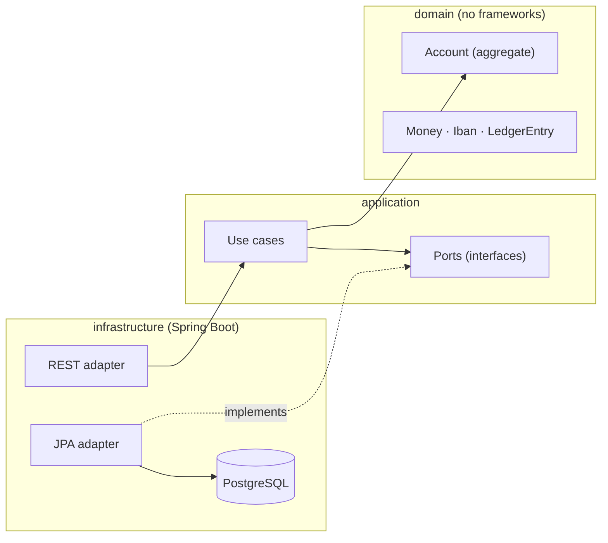

# bank-ledger-hexagonal

[](https://github.com/JesusBlazquez/bank-ledger-hexagonal/actions/workflows/ci.yml)


A banking ledger: accounts, deposits, withdrawals and transfers with the business rules a real bank
would need, built with hexagonal architecture and Domain-Driven Design.

## The problem it solves

Moving money is not a database update. A transfer has to respect the balance, a daily limit and the
currency of both accounts, it must never be applied twice if the request is retried, and every
movement has to leave a trace that can be audited afterwards.

This project implements those rules where they belong — in the domain model — so they cannot be
bypassed by adding a new controller or a new screen.

## Architecture



Dependencies only ever point inwards: `infrastructure → application → domain`. They are separate
Maven modules, so the rule is enforced by the compiler rather than by discipline: Spring is not even
on the domain's classpath.

## Tech stack

| Area | Technology |
|---|---|
| Language | Java 21 |
| Framework | Spring Boot 4.1 (web, validation, actuator, data-jpa) |
| Database | PostgreSQL, schema versioned with Flyway |
| Build | Maven multi-module (wrapper included) |
| Testing | JUnit 5, AssertJ, Mockito, Testcontainers |
| API docs | OpenAPI / Swagger UI |
| CI | GitHub Actions |

## Getting started

**Prerequisites:** JDK 21 and Docker.

```bash
git clone https://github.com/JesusBlazquez/bank-ledger-hexagonal.git
cd bank-ledger-hexagonal
docker compose up -d                  # starts PostgreSQL
./mvnw package -DskipTests            # builds the three modules
java -jar infrastructure/target/infrastructure-0.1.0-SNAPSHOT.jar
```

- API docs: <http://localhost:8080/swagger-ui.html>
- Health: <http://localhost:8080/actuator/health>

While developing, `./mvnw install -DskipTests` followed by `./mvnw spring-boot:run -pl infrastructure`
gives the same result with a faster edit-run loop. Note that adding `-am` would make Maven try to run
the parent POM as well, which has no main class.

### Running the tests

```bash
./mvnw verify                 # unit tests + integration tests (Testcontainers starts its own database)
```

## API

| Operation | Endpoint |
|---|---|
| Open an account | `POST /api/accounts` |
| Get balance and details | `GET /api/accounts/{id}` |
| Deposit | `POST /api/accounts/{id}/deposits` |
| Withdraw | `POST /api/accounts/{id}/withdrawals` |
| Transfer | `POST /api/transfers` |
| Transaction history | `GET /api/accounts/{id}/transactions` |

Commands accept an `Idempotency-Key` header. Errors are returned as Problem Details (RFC 9457).
Amounts travel as strings (`"100.00"`) so no client turns them into floating point numbers.

## Technical decisions

Each decision is recorded in full as an [Architecture Decision Record](docs/adr/).

| Decision | Why | ADR |
|---|---|---|
| Hexagonal architecture as separate Maven modules | The compiler, not a convention, keeps the domain framework-free | [0002](docs/adr/0002-hexagonal-architecture-with-maven-modules.md) |
| `Money` as a value object over `BigDecimal` | Floating point cannot represent money exactly | [0003](docs/adr/0003-money-as-a-value-object.md) |
| Append-only ledger with a derived balance | Auditable history, fast balance reads, recomputable | [0004](docs/adr/0004-append-only-ledger-with-derived-balance.md) |
| Transfers in a single local transaction | Correct and simple for one database; the distributed case is a different project | [0005](docs/adr/0005-transfers-in-a-local-transaction.md) |
| Idempotency enforced by a unique constraint | An application-level check loses under concurrency | [0006](docs/adr/0006-idempotency-via-unique-constraint.md) |
| Daily limit tracked inside the aggregate | Keeps the rule testable without a database | [0007](docs/adr/0007-daily-limit-inside-the-aggregate.md) |
| Testcontainers instead of H2 | H2 is not PostgreSQL, and the differences hide bugs | [0008](docs/adr/0008-testcontainers-over-h2.md) |
| JPA entities kept apart from the model | The aggregate should not carry a framework or the schema's shape | [0009](docs/adr/0009-separate-jpa-entities-from-the-domain.md) |
| Errors as Problem Details (RFC 9457) | Clients branch on a stable `type`, not on English text | [0010](docs/adr/0010-errors-as-problem-details.md) |
| Use cases wired by hand, not scanned | Keeps the application layer testable without Spring | [0011](docs/adr/0011-wire-use-cases-explicitly.md) |

## What I would do differently / next steps

- **Authentication and authorization are missing.** Every endpoint is open. They are the subject of a
  separate project, and the account holder would become the natural authorization boundary here.
- **The balance is stored as well as derivable.** That redundancy earns fast reads, but it should be
  guarded by a reconciliation job that recomputes balances from the ledger and reports any drift.
- **A transfer between accounts in different services cannot use a local transaction.** That case
  needs a Saga with compensating events, which is what the event-driven project in my profile shows.
- **Multi-currency accounts and exchange rates are deliberately left out:** they add accounting
  complexity without demonstrating anything new about the architecture.
- **Explicit wiring has a cost.** Declaring every use case by hand is what keeps the application
  layer free of Spring, and it is also where I made my only wiring mistake. It is a trade, not a
  free win.

### Notes from building it

Spring Boot 4 splits its auto-configuration into per-technology starters: having `flyway-core` on
the classpath is no longer enough for migrations to run, `spring-boot-starter-flyway` is required.
Testcontainers 2.0 renamed both its artifacts and its packages. And the PostgreSQL 18 image moved
its data directory, so a volume mounted at the old path stops the container from starting — caught
only by running the application from scratch, never by the tests.

## License

[MIT](LICENSE) © Jesús Blázquez Durán
